# MovieClips Platform

A Next.js application for a video platform where creators can upload content and earn money. The platform includes features such as video playback, liking, commenting, and sharing, along with analytics dashboards for creators to track their earnings and engagement.

## Website SS

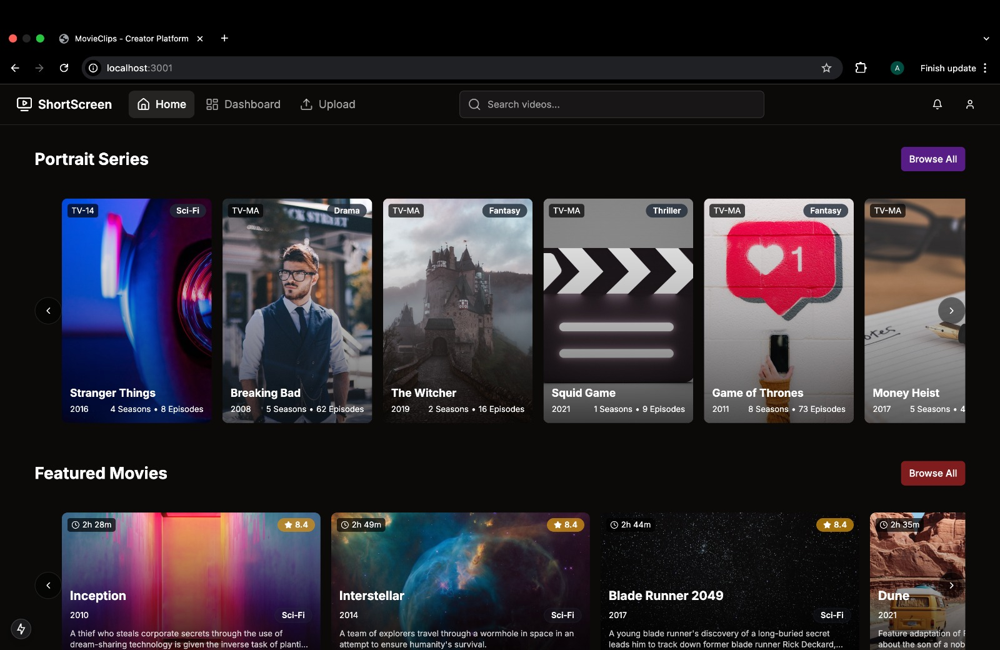
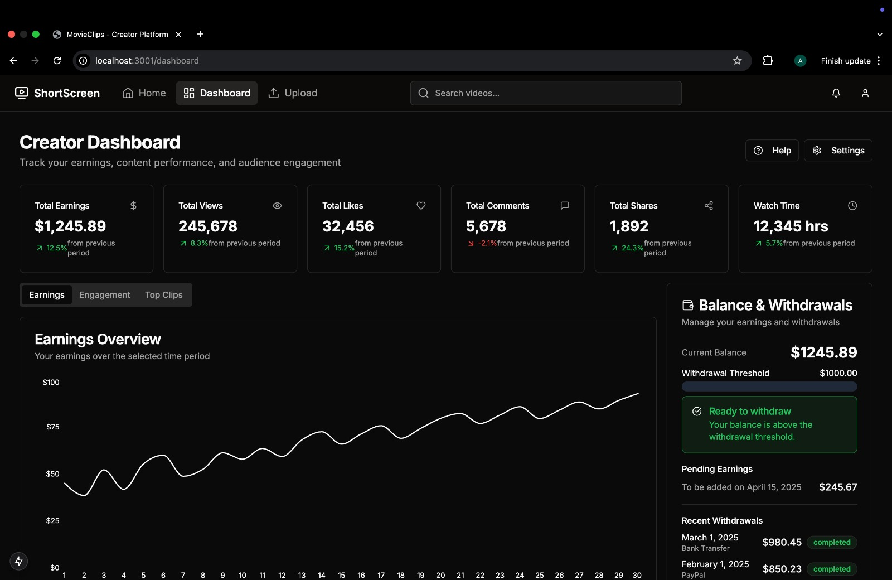
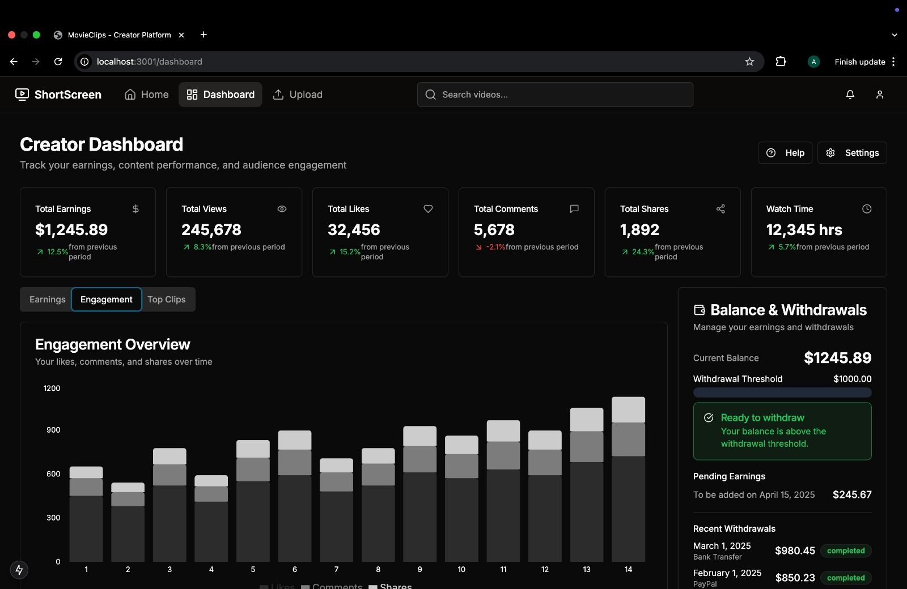
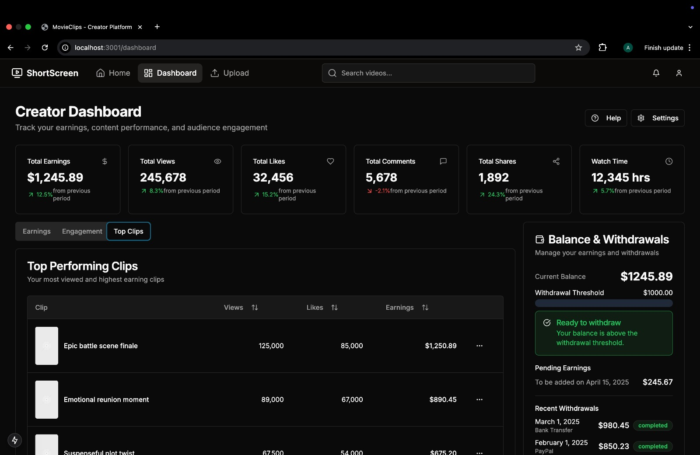
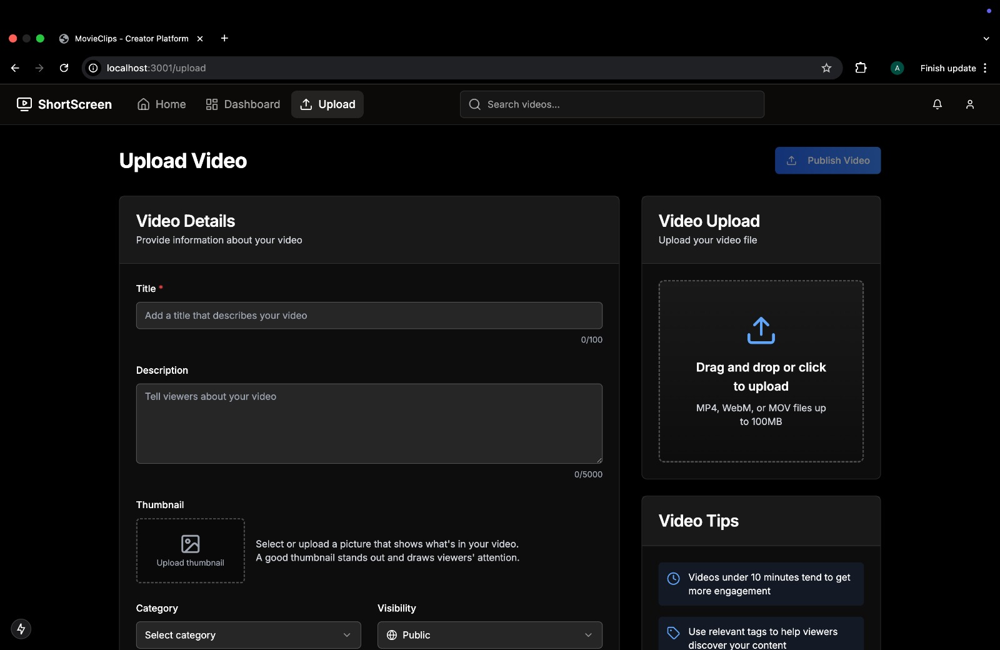
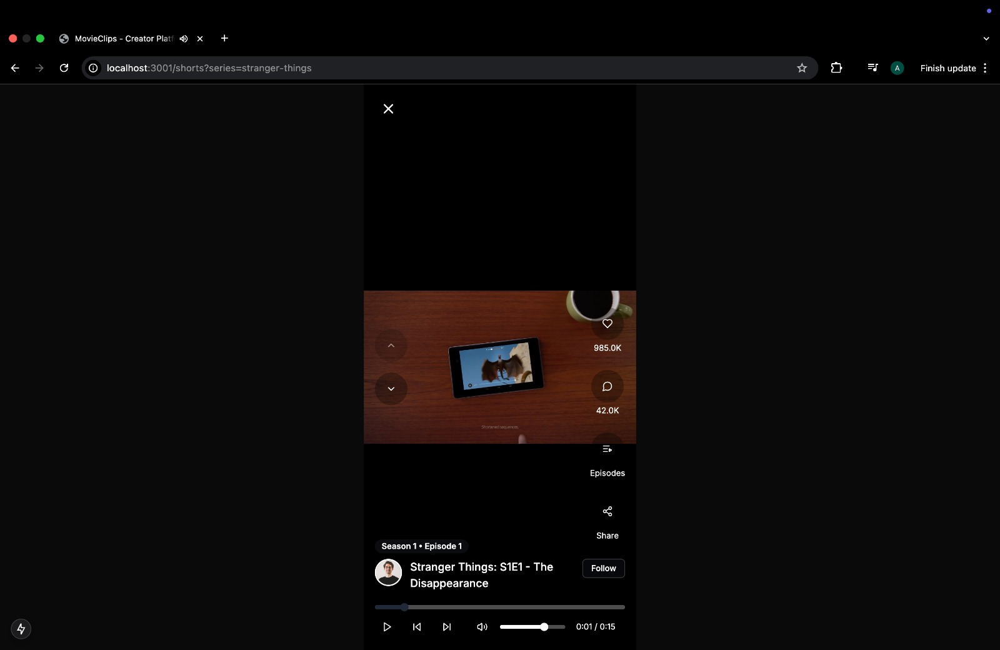
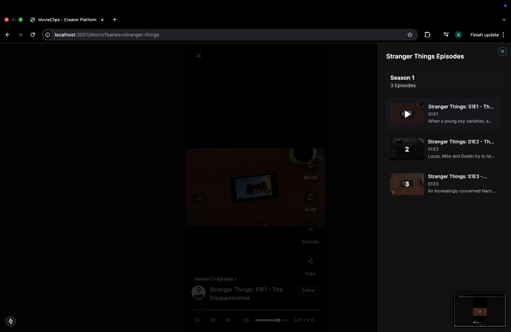
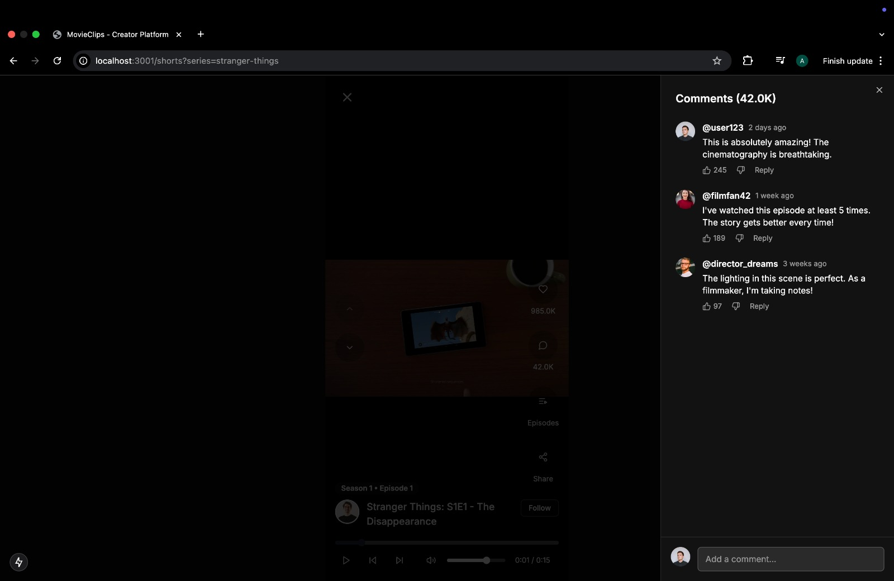
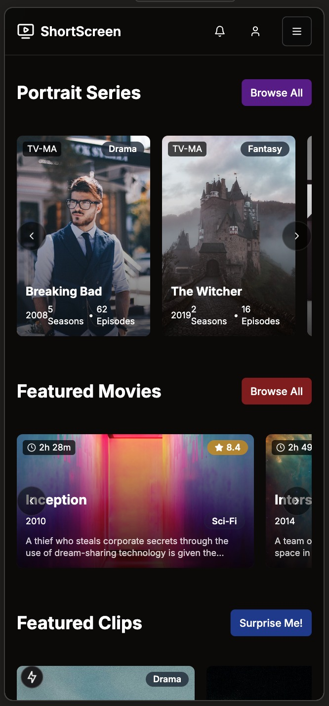
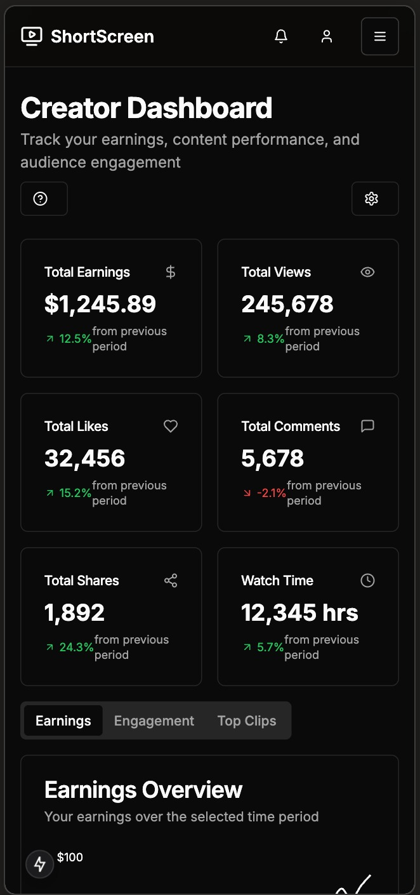
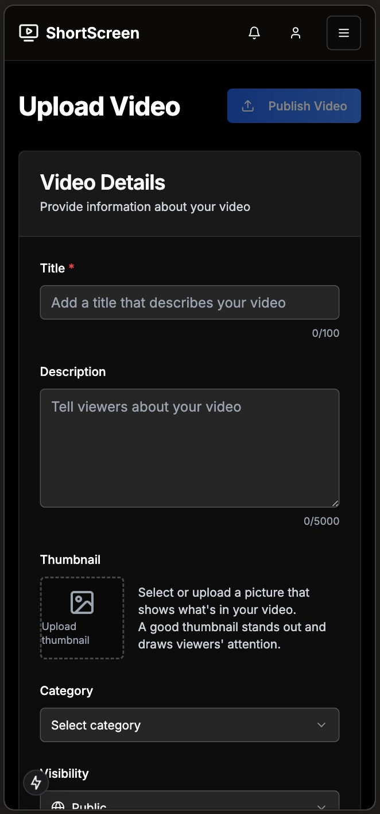
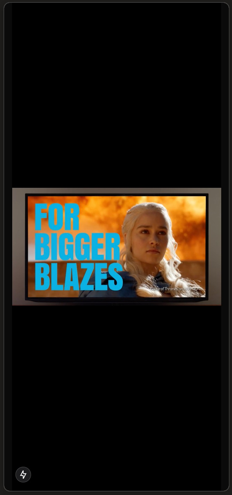

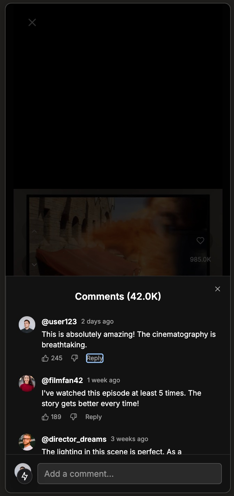

## Features

- Home page with scrollable clips/shorts
- Video playback page
- Shorts/clips player with swipe navigation
- Creator dashboard with analytics
- Dark mode support

## Tech Stack

- Next.js 14 (App Router)
- TypeScript
- Tailwind CSS
- shadcn/ui components
- Recharts for analytics charts
- Lucide React for icons

## Getting Started

### Prerequisites

- Node.js 18.17 or later
- npm, yarn, or pnpm

### Installation

1. Clone the repository:

bash
git clone https://github.com/adityaranacs/ShortScreen.git
cd movieclips-platform

2. Install dependencies:

bash
npm install

3. Build the project:

bash
npm run build

4. Run the development server:

bash
npm run dev

Open [http://localhost:3000](http://localhost:3000) to view the application in your browser.

## License

[MIT](LICENSE)
